# LoanAPP BI — Banking-Grade Credit Risk Engine

LoanApp BI adalah sistem analisis kelayakan kredit (*credit scoring & risk engine*) hibrida modern yang dirancang untuk platform keuangan, perbankan mikro, dan koperasi berbasis web/webview. Sistem ini menggabungkan kekuatan **Deterministic Business Rules (Rule Engine)** standar perbankan komersial dengan fleksibilitas **Advanced Ensemble Machine Learning** untuk menghasilkan keputusan kredit yang aman, cerdas, dan bebas dari anomali data.

By : **Alif Faqih Azmi**

##  Fitur Utama

- **Arsitektur Keputusan Hibrida (3-Layer Guard):**
  1. **Layer 1: Hard Rules Engine** – Menyaring penolakan mutlak (*Auto-Reject*) seperti rekam jejak gagal bayar (SLIK OJK/BI Checking), batas usia hukum, pendapatan minimal, skor kredit *deep subprime*, serta batas ekstrem kapasitas bayar (*Debt-to-Income Ratio*).
  2. **Layer 2: ML Inference Pipeline** – Memprediksi probabilitas kelayakan secara dinamis menggunakan model *Stacking Ensemble* jika aplikasi lolos dari gawang Layer 1.
  3. **Layer 3: Risk Warning Penalty** – Menyesuaikan tingkat keyakinan (*confidence score*) model ML berdasarkan indikator risiko dinamis seperti stabilitas kerja dan segmentasi DTI.
- **Segmented DTI Policy:** Membedakan batas aman rasio utang secara rasional berdasarkan kelas pendapatan (*Low-Income* vs *Mid-High Income*) untuk mengamankan sisa pendapatan hidup layak (*disposable income*).
- **Suku Bunga Dinamis Terkalibrasi:** Perhitungan DTI menggunakan rumus amortisasi anuitas perbankan riil, memastikan kenaikan suku bunga akan memperketat peluang kelayakan, bukan sebaliknya.
- **Interactive BI Dashboard:** Antarmuka berbasis Streamlit yang kaya fitur untuk simulasi pengajuan, visualisasi sebaran risiko, pengujian skenario stres (*stress testing*), dan pelacakan riwayat aplikasi.

---

##  Arsitektur Keputusan (Decision Flow)
Alur pemeriksaan berjalan atau decision making seperti ini:

```mermaid
flowchart TD
    %% 1. INPUT STEP
    Start([Mulai: Aplikasi Kredit Diterima]) --> Inp[Ekstrak Fitur: Income, Loan Amount, Score, Rate, dll]
    Inp --> CalcDTI[Hitung Estimasi Cicilan Bulanan & Banking DTI via Amortisasi Anuitas]

    %% 2. LAYER 1: HARD REJECT GATE
    CalcDTI --> L1_Gate{"Apakah Masuk Kategori:<br/>1. Gagal Bayar Aktif (prev_default=1)<br/>2. Usia < 21 atau > 65<br/>3. Income < Rp 12Jt/Thn<br/>4. Credit Score < 450<br/>5. Banking DTI > 65%?"}
    
    L1_Gate -- YA (Ada Pelanggaran) --> SetHard["Set final_decision = 'HARD_REJECT'<br/>Ambil pesan error pertama"]
    SetHard --> RejectOutput

    %% 3. LAYER 2: MACHINE LEARNING INFERENCE
    L1_Gate -- TIDAK (Lolos Semua) --> ML_Inference["Jalankan Stacking Ensemble Model<br/>(XGBoost + LightGBM + CatBoost)"]
    ML_Inference --> ML_Prob[Dapatkan Probabilitas Kelayakan ML: 'prob_score' 0.0 - 1.0]

    %% 4. LAYER 3: RISK WARNINGS & PENALTY CALCULATION
    ML_Prob --> InitPenalty[Inisialisasi confidence_penalty = 0.0]
    
    %% W1: Segmented DTI
    InitPenalty --> CheckDTI{"Income < Rp 36Jt (Low-Tier)?"}
    CheckDTI -- YA --> LowDTI{"Banking DTI > 35%?"}
    CheckDTI -- TIDAK --> MidDTI{"Banking DTI > 50%?"}
    
    LowDTI -- YA --> P1[confidence_penalty += 0.25]
    MidDTI -- YA --> P1
    LowDTI -- TIDAK --> CheckLTI
    MidDTI -- TIDAK --> CheckLTI
    
    %% W2: Loan to Income
    P1 --> CheckLTI
    CheckLTI{"Loan Amount / Income > 3x?"}
    CheckLTI -- YA --> P2[confidence_penalty += 0.15]
    CheckLTI -- TIDAK --> CheckScore
    
    %% W3: Credit Score Fair
    P2 --> CheckScore
    CheckScore{"Credit Score < 600?"}
    CheckScore -- YA --> P3[confidence_penalty += 0.10]
    CheckScore -- TIDAK --> CheckExp
    
    %% W4: Job Stability
    P3 --> CheckExp
    CheckExp{"Masa Kerja < 1 Tahun?"}
    CheckExp -- YA --> P4[confidence_penalty += 0.05]
    CheckExp -- TIDAK --> FinalPenaltyCalc
    
    %% Accumulation
    P4 --> FinalPenaltyCalc
    FinalPenaltyCalc["Hitung Akumulasi Penalti Akhir<br/>penalty = min(total_penalty, 0.50)"]

    %% 5. FINAL SCORE & DECISION MATRIX
    FinalPenaltyCalc --> FinalScoreCalc["Skor Akhir = prob_score - penalty"]
    FinalScoreCalc --> DecisionGate{"Apakah Skor Akhir >= 0.50?"}
    
    DecisionGate -- YA --> ApproveOutput["Set final_decision = 'APPROVED'"]
    DecisionGate -- TIDAK --> RejectOutput["Set final_decision = 'REJECTED'"]

    %% OUTPUT ENDPOINTS
    ApproveOutput --> EndApp([TAMPILKAN STATUS: DISETUJUI<br/>Simpan ke Database])
    RejectOutput --> EndRej([TAMPILKAN STATUS: DITOLAK<br/>Sertakan Alasan Penolakan])

    %% Penerapan Kelas Gaya
    class Start,EndApp,EndRej start_end;
    class Inp,CalcDTI,InitPenalty,FinalPenaltyCalc,FinalScoreCalc process;
    class L1_Gate,CheckDTI,LowDTI,MidDTI,CheckLTI,CheckScore,CheckExp,DecisionGate condition;
    class SetHard hard_reject;
    class ML_Inference,ML_Prob ml_layer;
    class P1,P2,P3,P4 penalty;
    class ApproveOutput final_app;
    class RejectOutput final_rej;
```


## HOW TO USE :
1. clone repository & install dependensi:
```bash
pip install -r requirements.txt
```
2. migrasi data ke SQL
```bash
python to_sql,py
```
akan membuat database loans.db, buat new connection ke SQLite lalu koneksikan ke loans.db
3. train model ML
```bash
python loan_predictor.py
```
proses ini akan menjalankan Optuna untuk mencari hyperparameter terbaik secara otomatis, mengevaluasi model Stacking Ensemble, lalu memproduksi file pipe_ensemble.pkl, model_meta.json, dan model_report.txt
4. run dashboard
```bash
streamlit run loan_dashboard.py
#atau
python -m streamlit run loan_dashboard.py
```

## Parameter Konfigurasi (loan_rule.py)
```bash
RULES_CONFIG = {
    # HARD REJECT THRESHOLDS (Aman Mutlak) 
    "ABS_MAX_DTI_RATIO"       : 0.65,      # Maksimal cicilan 65% dari gaji bulanan
    "MIN_CREDIT_SCORE_HARD"   : 450,       # Di bawah 450 otomatis ditolak (Deep Subprime)
    "MIN_AGE_HARD"            : 21,        # Usia legal penandatanganan akad kontrak
    "MAX_AGE_HARD"            : 65,        # Batas akhir tenor pinjaman (Masa Pensiun)
    "MIN_INCOME_HARD"         : 12000000,  # Rp 1 Juta/bulan batas pendapatan minimal

    # WARNING THRESHOLDS (Sistem Pengurang Skor ML)
    "LOW_INCOME_TIER"         : 36000000,  # Batas segmentasi pendapatan rendah (< 3 Juta/bln)
    "LOW_INCOME_MAX_DTI"      : 0.35,      # DTI kelas pendapatan rendah maksimal 35%
    "MID_INCOME_MAX_DTI"      : 0.50,      # DTI kelas menengah-atas maksimal 50%
    "WARN_CREDIT_SCORE"       : 600,       # Skor di bawah 600 masuk pemantauan ketat
    "WARN_LOAN_TO_INCOME"     : 3.0,       # Total pinjaman tidak boleh > 3x pendapatan setahun
    "WARN_NEW_EMPLOYEE"       : 1,         # Masa kerja < 1 tahun mendapat penalti risiko
    }

    ##Sistem ini dirancang khusus untuk mengatasi kelemahan umum pada kecerdasan buatan (AI model vulnerabilities) di mana model ML sering kali meloloskan pinjaman berisiko tinggi hanya karena nasabah dibebani suku bunga tinggi (high-yield trap). 
    ##Dengan formula kalkulasi Banking DTI yang tertanam pada sistem, simulasi pengajuan ekstrem seperti Pinjaman Rp120 Juta dengan Pendapatan Rp72 Juta (DTI > 100%) akan langsung Diputus Mati (HARD_REJECT) pada Layer 1 aturan bisnis sebelum sempat diproses oleh model ML
```

